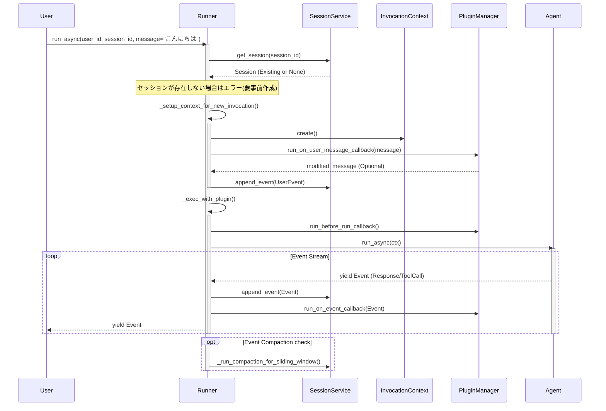
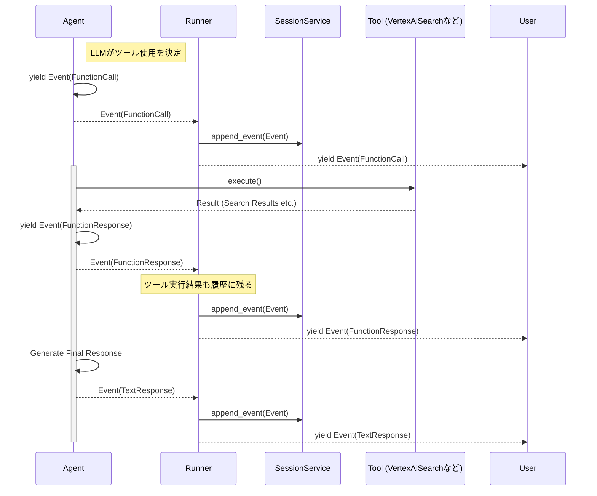
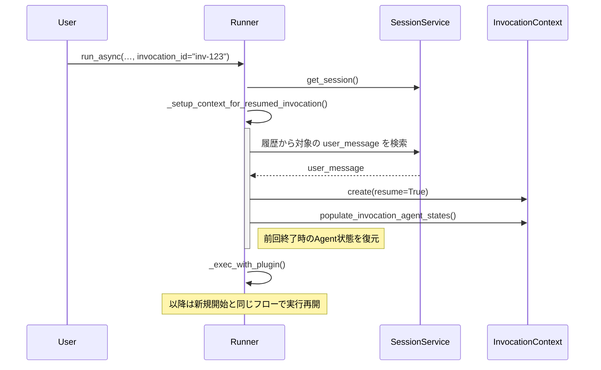

# Runner Deep Dive: シーケンス図による動作解析

Runner が具体的にどのように動作しているか、主要なパターン（新規会話開始、ツール実行とイベント処理）をシーケンス図で示します。

## 1. 新規会話の開始 (Start Invocation)

ユーザーが新しいメッセージを送信し、Agent が応答を開始するまでのフローです。

### ポイント
1.  **前処理**: Agent が動く前に、Runner はセッションの取得、コンテキスト作成、ユーザーメッセージの永続化（`append_event`）を完了させます。
2.  **イベントループ**: Agent が `yield` したイベントは、即座にユーザーに返されるだけでなく、Runner によって**同時に `SessionService` へ保存**されます。これが「Runner を通さないと記憶喪失になる」理由の技術的詳細です。

## 2. ツール実行とイベント処理

Agent がツール（検索など）を呼び出す場合のフローです。ADK ではツール実行結果も `Event` として扱われます。

### ポイント
1.  **Function Call もイベント**: 「検索したい」という要求 (`FunctionCall`) も、「検索結果」 (`FunctionResponse`) も、すべて `Event` として Runner 経由で保存されます。
2.  **一元管理**: これにより、会話履歴には「ユーザー発言 -> Agent検索要求 -> 検索結果 -> Agent最終回答」という完全なログが残り、次回の会話で文脈として利用可能になります。

## 3. 会話の再開 (Resume Invocation)

中断された処理や、特定の状態からの再開を行う場合です。（`invocation_id` 指定）

### ポイント
1.  **状態復元**: Runner はセッション履歴から過去の `AgentState` を読み出し、Agent を「前回の続き」から動かせるようにセットアップします。
