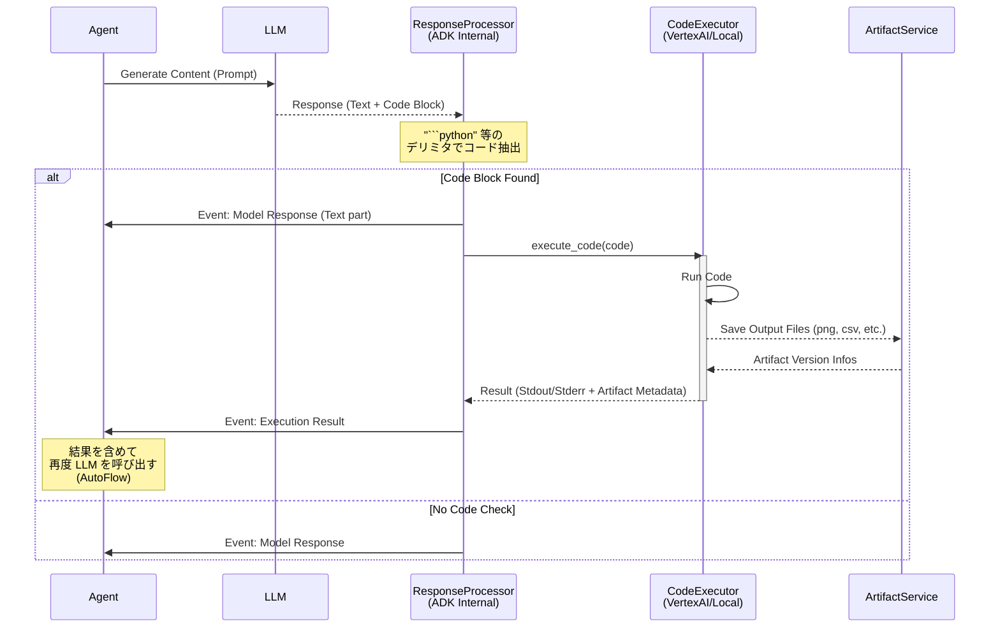

# CodeExecutor について

`CodeExecutor` は、Agent が生成したコードを実行し、その結果（テキスト出力や生成ファイル）を取得するためのコンポーネントです。
Google ADK (Agent Development Kit) では、抽象基底クラス `BaseCodeExecutor` と、いくつかの具体的な実装が提供されています。

## 1. 概要

Agent は LLM のレスポンスに含まれるコードブロック（例: \`\`\`python ... \`\`\`）を検出し、それを `CodeExecutor` に渡して実行します。
`CodeExecutor` はコードを実行した後、標準出力 (`stdout`)、標準エラー (`stderr`)、および生成されたファイル（画像やCSVなど）を `CodeExecutionResult` として返します。

主な役割:
*   コードの実行環境の提供（ローカル、コンテナ、Vertex AI 上など）。
*   実行結果のパースと整形。
*   生成されたファイルの Artifact 化（`File` オブジェクトへの変換）。

## 2. 主なクラス構成

### BaseCodeExecutor (`google.adk.code_executors.base_code_executor`)

すべての CodeExecutor の基底クラスです。共通の設定やインターフェースを定義しています。

*   **主な属性**:
    *   `optimize_data_file`: モデルのリクエストからデータファイル（CSVなど）を抽出・処理するかどうか。
    *   `stateful`: ステートフルな実行（前の実行結果を保持する）かどうか。
    *   `error_retry_attempts`: エラー時の再試行回数（デフォルト: 2）。
    *   `code_block_delimiters`: コードブロックを識別するためのデリミタ。
    *   `execution_result_delimiters`: 実行結果をフォーマットする際のデリミタ。

### VertexAiCodeExecutor (`google.adk.code_executors.vertex_ai_code_executor`)

Vertex AI の **Code Interpreter Extension** を利用してコードを実行する実装です。
セキュアでスケーラブルな実行環境を提供し、データ分析や可視化に適しています。

*   **特徴**:
    *   **Extension 利用**: Vertex AI Extensions の Code Interpreter リソースを使用します。
    *   **リソース管理**: `resource_name` を指定することで既存の Extension インスタンスを再利用できます。指定がない場合は新規作成されます。
    *   **定義済みライブラリ**: 実行時に以下のライブラリが自動的にインポートされます（コードの先頭に追加されます）。
        *   `io`, `math`, `re`
        *   `matplotlib.pyplot as plt`
        *   `numpy as np`
        *   `pandas as pd`
        *   `scipy`
        *   ヘルパー関数: `crop` (文字列切り詰め), `explore_df` (DataFrame の要約表示)
    *   **Artifact 処理**:
        *   出力ファイルは自動的に検出され、拡張子に基づいて MIME タイプが設定されます。
        *   **画像**: `png`, `jpg`, `jpeg` -> `image/*`
        *   **データ**: `csv` -> `text/csv`
        *   その他は `mimetypes.guess_type` で推定されます。

## 3. その他の実装

*   `UnsafeLocalCodeExecutor`: ローカル環境で直接コードを実行します（**非推奨**: セキュリティリスクがあるため、テスト用途以外では使用しないでください）。
*   `ContainerCodeExecutor`: Docker コンテナ内でコードを実行します。
*   `GkeCodeExecutor`: GKE (Google Kubernetes Engine) 上でコードを実行します。

## 4. 利用フロー (Artifact 生成の観点)

1.  Agent がコードを生成する。
2.  `CodeExecutor.execute_code()` が呼ばれる。
3.  (`VertexAiCodeExecutor` の場合) Vertex AI 上でコードが実行される。
4.  グラフ描画 (`plt.savefig(...)`) などでファイルが生成されると、Code Interpreter がそれをキャプチャする。
5.  `VertexAiCodeExecutor` が出力を解析し、ファイルデータを `File` オブジェクト（content, mime_type, name）に変換して返す。
6.  `InvocationContext` を通じて `ArtifactService` に保存される（詳細は `adk_artifact_explanation.md` 参照）。

## 5. 実行フローの詳細 (Execution Flow Details)

ユーザーの疑問「ADKが正規表現などでチェックして実行しているのか？」に対する答えは **YES** です。
ADK の内部コンポーネント (`_CodeExecutionResponseProcessor`) が LLM のレスポンスを解析し、定義された**デリミタ**（例: `` ```python `` と `` ``` ``）で囲まれたブロックを検出して実行します。

### シーケンス図



### 詳しい処理の流れ

1.  **解析 (Parsing)**:
    *   `google.adk.flows.llm_flows._code_execution` モジュールが LLM のレスポンスを受け取ります。
    *   `CodeExecutor` に設定された `code_block_delimiters` (デフォルトは `['\`\`\`tool_code\n', '\n\`\`\`']` や `['\`\`\`python\n', '\n\`\`\`']`) を使って、文字列マッチングでコード部分を切り出します。
    *   **ポイント**: LLM自体が「関数呼び出し」をしているわけではなく、LLMはただ「Markdownのコードブロックを含むテキスト」を返しているだけです。それをADK側がパースして実行トリガーとしています。

2.  **実行 (Execution)**:
    *   抽出されたコード文字列が `execute_code()` メソッドに渡されます。
    *   コード内でファイル生成（例: `plt.savefig('plot.png')`）が行われると、Executor はそれを検出します。

3.  **結果のフィードバック**:
    *   実行結果（標準出力やエラー）は、次のターンで LLM への入力（User Message または Function Response 扱い）としてフィードバックされます。
    *   これにより、LLM は「コードを実行したらエラーが出たから修正しよう」や「グラフができたからユーザーに報告しよう」といった判断が可能になります。
