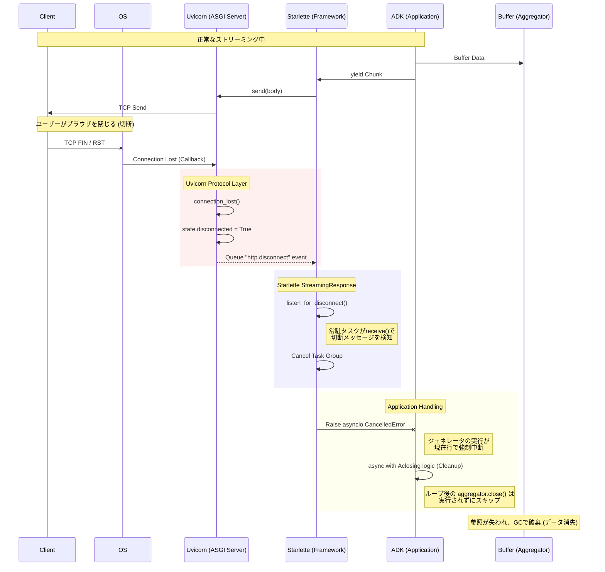

# Webサーバーにおけるクライアント切断検知メカニズム (Deep Dive)

## 概要

クライアント(ブラウザ等)からの切断は、OSレベルのTCP接続終了から始まり、ASGIサーバー(Uvicorn)を経てWebフレームワーク(Starlette/FastAPI)に伝わり、最終的にアプリケーションタスクのキャンセル(`CancelledError`)として処理されます。

この一連の流れにより、ADKのストリーミング生成処理(`run_agent_sse`)は強制的に中断され、結果としてバッファリングされていたデータはメモリ上から消失します。

## シーケンス詳細 (Mermaid)



## ソースコードレベルの裏付け

### 1. Uvicorn: 切断イベントの発行
`uvicorn/protocols/http/httptools_impl.py` (または `h11_impl.py`) において、OSからの切断通知を受け取ると、ASGIの `receive` チャンネルに `http.disconnect` メッセージをキューイングします。

```python
# Uvicorn (Conceptual)
def connection_lost(self, exc):
    self.cycle.disconnected = True
    self.cycle.message_event.set() # receive()待ちを解除

async def receive(self):
    if self.disconnected:
        return {"type": "http.disconnect"}
```

### 2. Starlette: 切断の監視とキャンセル
`starlette/responses.py` の `StreamingResponse` クラスは、レスポンスの送信(`stream_response`)と並行して、切断信号の監視(`listen_for_disconnect`)を行います。

```python
# Starlette (starlette/responses.py)
async def listen_for_disconnect(self, receive: Receive) -> None:
    while True:
        message = await receive()
        if message["type"] == "http.disconnect":
            break # 切断検知

async def __call__(self, scope, receive, send):
    async with anyio.create_task_group() as task_group:
        # 送信タスクと監視タスクを並行実行
        task_group.start_soon(self.stream_response, send)
        await self.listen_for_disconnect(receive)
        
        # 監視タスクが終了(切断検知)すると、グループ全体をキャンセル
        task_group.cancel_scope.cancel() 
```

### 3. ADK: 中断とバッファ消失
Starletteによるタスクキャンセルは、Pythonの `asyncio.CancelledError` としてADKのコード内で発生します。これにより `run_agent_sse` 内のジェネレータは即座に停止し、関数末尾にある保存処理(`aggregator.close()`)に到達することなく終了します。

```python
# ADK (google/adk/models/google_llm.py)
aggregator = StreamingResponseAggregator()
try:
    # ... ストリーミングループ ...
    yield partial_response # <--- ここで CancelledError 発生
except GeneratorExit:
    pass # クリーンアップのみ実行

# ↓ この行には永遠に到達しない
if (close_result := aggregator.close()) is not None:
   yield close_result
```

### 結論
- ユーザーの推測通り、**Uvicornが切断を検知**します。
- その後、**Starletteがそれを拾ってタスクをキャンセル**します。
- その結果、ADKの処理が中断され、**バッファは保存されずに消滅**します。
