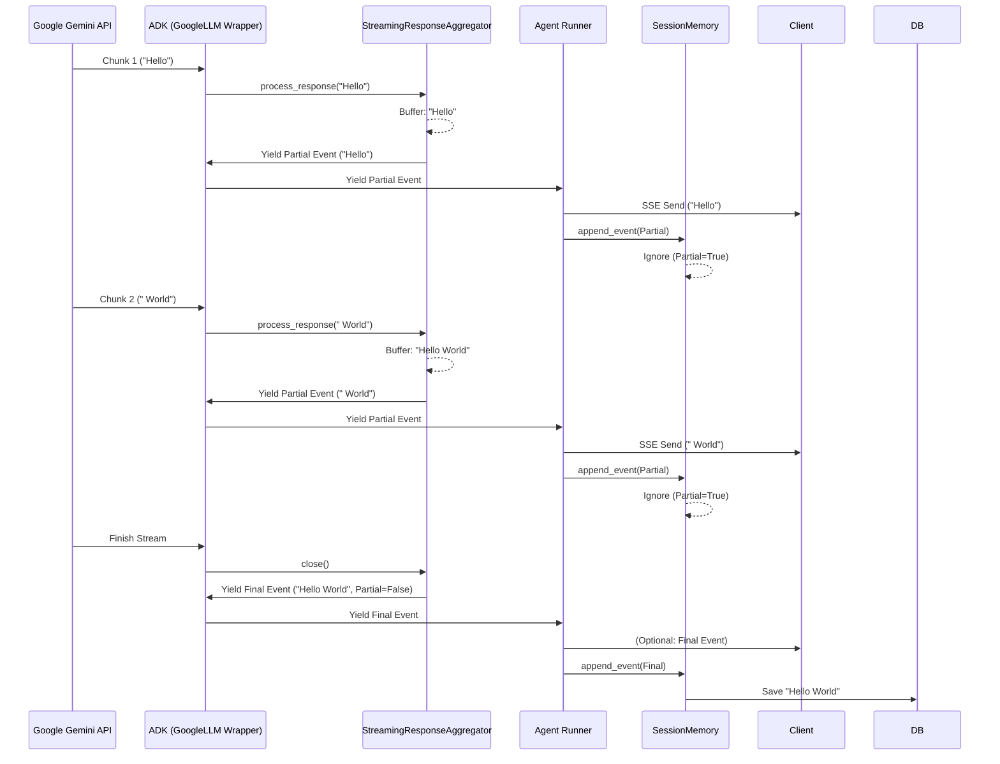

# SSEとSessionMemoryのアーキテクチャ詳細：中間状態の保持について

## ハイライト
- **中間状態の保持場所**: `google.adk.utils.streaming_utils.StreamingResponseAggregator` クラスのインスタンス内。
- **メカニズム**: ストリーミング受信時にメモリ上でテキストをバッファリングし、最後に「完全なイベント」として放出します。

---

## データフローと状態保持の仕組み

ユーザーの疑問である「Yieldの途中状態をどこかで一時的に保持しているのか」に対する答えは **YES** です。具体的には、ADK内部の `StreamingResponseAggregator` がその役割を担っています。

### 1. 処理の流れ (Architecture Flow)



### 2. 中間状態の保持 (`StreamingResponseAggregator`)

ソースコード `google/adk/utils/streaming_utils.py` にある `StreamingResponseAggregator` クラスがバッファリングの実体です。

このクラスは、`generate_content_async` メソッド（`google/adk/models/google_llm.py`）内でインスタンス化され、ストリーミングループの間ずっと生存します。

```python
# 概念コード
class StreamingResponseAggregator:
    def __init__(self):
        self._text = ''  # <--- ここに蓄積される
        self._parts_sequence = [] # Progressive SSEの場合はこちら

    async def process_response(self, response):
        # チャンクを受け取りバッファに追加
        self._text += response.text
        # Partial=True としてチャンクを返す
        yield LlmResponse(..., partial=True)

    def close(self):
        # 最後に蓄積された全テキストを持つイベントを返す
        return LlmResponse(content=self._text, partial=False)
```

### 3. SessionMemoryの挙動

`InMemorySessionService`（および他のSession実装）は、`append_event` メソッドでイベントを受け取りますが、**`event.partial` フラグが `True` の場合は保存処理をスキップ**します。

したがって、データベースやメモリ上のセッションストアには、ストリーミング中の断片的なデータは書き込まれず、最後に `Aggregator` が吐き出した「完全なメッセージ」だけが記録されることになります。

これにより、ユーザーから見ると「ストリーミング中は文字がパラパラ出てくるが、後で履歴を見ると綺麗な一つのメッセージになっている」という状態が実現されています。

### 結論

- **Yieldの途中状態**は、ADKライブラリ内の **`StreamingResponseAggregator` インスタンス**（の `_text` や `_parts_sequence` 属性）に保持されています。
- このインスタンスは、Pythonのジェネレータ関数 `generate_content_async` のローカルスコープに存在し、ストリーミングが完了するまでメモリ上に維持されます。
